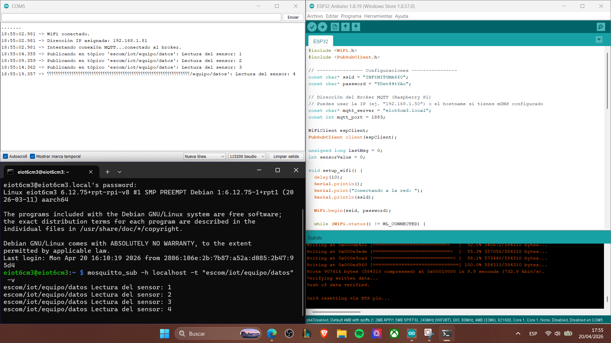

# Instalación y Configuración de Mosquitto MQTT en Raspberry Pi con Publisher ESP32

## 📝 Descripción
Este proyecto demuestra la implementación de una arquitectura de mensajería **IoT** utilizando el protocolo **MQTT**. Se configuró una **Raspberry Pi** como el Broker central (Mosquitto) y una **ESP32** como un cliente Publisher que envía datos simulados de sensores en tiempo real.

---

## 🛠️ Requisitos e Infraestructura
| Componente | Detalle |
| :--- | :--- |
| **Broker** | Raspberry Pi (Debian Bullseye/Bookworm) |
| **Microcontrolador** | ESP32 (NodeMCU) |
| **Protocolo** | MQTT v3.1.1 |
| **Hostname del Broker** | `eiot6cm3.local` |
| **Puerto** | 1883 |

---

## 🚀 Configuración del Sistema

### 1. Servidor (Raspberry Pi)
Se realizaron los siguientes pasos para asegurar el funcionamiento del Broker:
1. Actualización de repositorios: `sudo apt update`
2. Instalación de paquetes: `sudo apt install mosquitto mosquitto-clients`
3. Habilitación del servicio: `sudo systemctl enable mosquitto`
4. **Configuración de acceso externo:** Se modificó `/etc/mosquitto/conf.d/external.conf` para permitir conexiones anónimas y escuchar en el puerto 1883.

### 2. Nodo Embebido (ESP32)
El código utiliza la librería `PubSubClient`. La lógica principal incluye:
- Conexión persistente a la red WiFi.
- Generación de un `ClientID` único para evitar colisiones.
- Publicación de datos en el tópico `escom/iot/equipo/datos` cada 5 segundos.

---

## 📸 Evidencias de Funcionamiento

### Prueba de Mensajería Local
Prueba inicial utilizando comandos de consola en la Raspberry Pi para verificar que el broker acepta mensajes localmente.

### Integración ESP32 -> Raspberry Pi
Monitorización de los mensajes recibidos en la Raspberry Pi enviados desde el microcontrolador ESP32 en tiempo real.

### Acceso Remoto
Conexión exitosa vía SSH al broker `eiot6cm3.local`.

---

## 📚 Objetivos de Aprendizaje Alcanzados
* Comprensión del modelo **Publish/Subscribe**.
* Configuración de servicios en sistemas basados en Linux (Raspberry Pi).
* Integración de hardware embebido con redes inalámbricas.
* Documentación técnica siguiendo estándares de la industria mediante Git/GitHub.

---

## 👤 Autor
* **Sanchez De Jesus Arlet (Arlet-S)** 